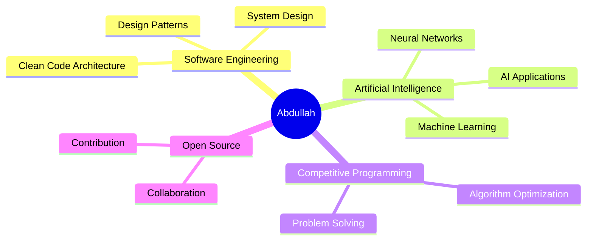

<div align="center">
  
</div>

<h1 align="center">
  
</h1>

<p align="center">
  <em>Building systems that matter, one line at a time.</em>
</p>

<p align="center">
  
  
  
</p>

<br>

##  About Me

```java
public class Developer {
    String name = "Abdullah Shahriar";
    String role = "CSE Undergraduate";
    String[] languages = {"C", "Java", "Python"};
    String[] strengths = {"Problem Solving", "Logic Building", "Clean Code"};
    
    void currentFocus() {
        System.out.println("Exploring Software Engineering & AI");
        System.out.println("Building foundational projects in C and Java");
        System.out.println("Competing in hackathons and collaborative development");
    }
    
    String philosophy() {
        return "Consistency over intensity. Growth over perfection.";
    }
}
```

<br>


## Technical Expertise

<table align="center">
  <tr>
    <td align="center" width="50%">
      <h3>Core Languages</h3>
      
      
      
    </td>
    <td align="center" width="50%">
      <h3>Core Competencies</h3>
      <p>Problem Solving & Algorithm Design</p>
      <p>Data Structures & OOP</p>
      <p>Logic Building & Debugging</p>
    </td>
  </tr>
  <tr>
    <td align="center" colspan="2">
      <h3>Development Tools</h3>
      
      
      
      
    </td>
  </tr>
</table>

<br>


## Featured Project

<div align="center">

### **Uni Serve** — University Assistant System


</div>

A comprehensive command-line application built in **C** to streamline university administrative workflows. This project demonstrates proficiency in modular programming, file I/O operations, and building user-centric CLI interfaces from scratch.

**Core Features:**
- Student information management with file-based persistence
- Course registration and academic tracking system
- Intuitive menu-driven interface for seamless navigation
- Modular architecture ensuring maintainability and scalability

**Technical Highlights:**
- Pure C implementation with no external dependencies
- Structured programming with clear separation of concerns
- Efficient file handling for data storage and retrieval
- Input validation and error handling mechanisms

<br>


## Hackathon & Competitive Experience

<table align="center">
  <tr>
    <td align="center" width="33%">
      
      <h3>Winner</h3>
      <p>Secured victory in competitive<br>programming hackathons</p>
    </td>
    <td align="center" width="33%">
      
      <h3>Workshop Training</h3>
      <p>Intensive preparation through<br>hands-on coding workshops</p>
    </td>
    <td align="center" width="33%">
      
      <h3>Team Player</h3>
      <p>Strong collaboration and<br>presentation skills</p>
    </td>
  </tr>
</table>

**Experience Gained:**
- Rapid prototyping and problem-solving under time constraints
- Effective communication and technical presentations in competitive settings
- Collaborative development with cross-functional teams
- Public speaking and idea articulation to technical and non-technical audiences

<br>


## Current Focus & Interests

<div align="center">



</div>

**Actively Exploring:**
- Software Engineering principles, design patterns, and architectural best practices
- Artificial Intelligence fundamentals and machine learning algorithms
- Advanced problem-solving techniques and competitive programming
- Open-source contribution and collaborative software development

**Philosophy:** Committed to **long-term excellence** through **consistent growth**, continuous learning, and building a strong technical foundation.

<br>


## GitHub Analytics

<div align="center">
  
  
</div>

<div align="center">
  
</div>

<br>


## Let's Connect

<div align="center">

[](https://linkedin.com/in/abdullah-shahriar)
[](https://github.com/Abdullah-Shahriar)
[](mailto:your.email@example.com)

<br>

**Open to learning opportunities, internships, and collaborative projects.**

<br>


</div>

<br>

<div align="center">
  
</div>
