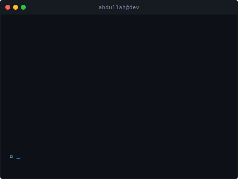

# Abdullah Shahriar

**Cross-Functional Orchestrator · Full Stack Developer · Zero-to-One Engineer**

 

<!-- ─── Announcement / Punchline ─── -->

  

 

<table>
<tr>
<td width="370" valign="top">

</td>
<td width="490" valign="top">

</td>
</tr>
</table>

 

<!-- ─── GitHub Analytics ─── -->

 

This README auto-updates daily via GitHub Actions.

