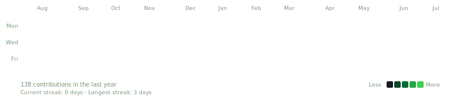

# Abdullah Shahriar

**Cross-Functional Orchestration · Full Stack Development · Zero-to-One Engineering**

 

<table>
<tr>
<td width="370" valign="top">

</td>
<td width="490" valign="top">

</td>
</tr>
</table>

 

<!-- ─── GitHub Analytics ─── -->

 

 

 

<picture>
  <source media="(prefers-color-scheme: dark)" srcset="https://ssr-contributions-svg.vercel.app/_/Abdullah-Shahriar?chart=calendar&gap=0.8&animation=wave&animation_duration=2&animation_delay=0.04&animation_amplitude=16&format=svg&weeks=52&theme=green">
  <source media="(prefers-color-scheme: light)" srcset="https://ssr-contributions-svg.vercel.app/_/Abdullah-Shahriar?chart=calendar&gap=0.8&animation=wave&animation_duration=2&animation_delay=0.04&animation_amplitude=16&format=svg&weeks=52&theme=green">
  
</picture>

 

 

<!-- ─── Contribution Heatmap (auto-updated daily) ─── -->

 

This README auto-updates daily via GitHub Actions.

